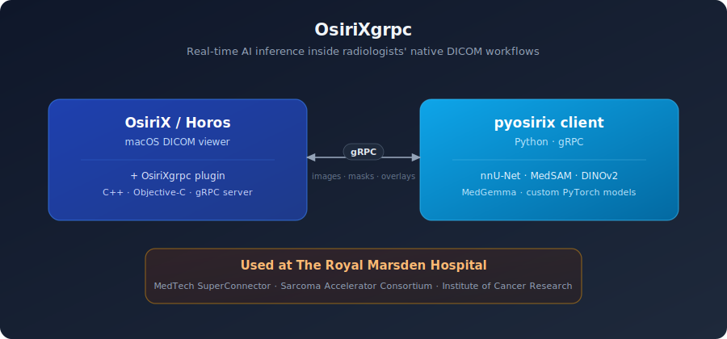
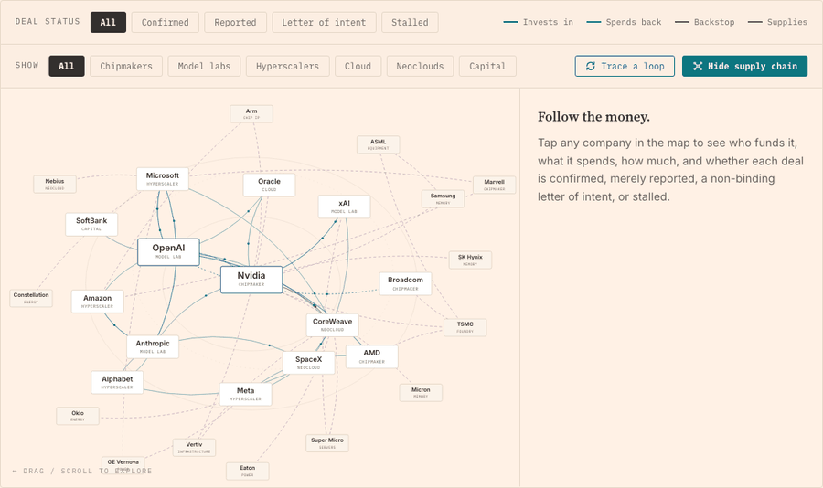

<!--
README v5: refreshed to reflect mid-2026 projects.
- "Currently" updated: interactive AI explainers + privacy/audit + consulting.
- "On Hugging Face" broadened into "Selected projects" with themed groups:
  Clinical AI, Privacy & audit tooling, Interactive AI explainers,
  Applied ML & data tooling, and Personal experiments.
- Carries forward v4: calm waving header, two-line typing SVG, OsiriXgrpc
  architecture SVG, lowlighter metrics + summary cards, snake activity.
-->

  

  

  
  
  
  
  

  
  
  

---

> **TLDR.** PhD in AI and Cancer Imaging at the Institute of Cancer Research; co-created [OsiriXgrpc](https://github.com/osirixgrpc/osirixgrpc), a clinical AI plugin used at The Royal Marsden Hospital for research. Previously delivered a 30% volume uplift and £5M increase in GWP on motor new business in commercial ML in the insurance industry. 11 abstracts/papers across MICCAI, AAAI, ISMRM, MIDL

### About

I build AI systems across healthcare, insurance, and applied research. PhD in AI and Cancer Imaging from the Institute of Cancer Research, where I shipped a clinical AI platform now used at The Royal Marsden Hospital. Before research, I led ML-driven pricing at Ageas Insurance.

Now running an AI and data analytics consultancy taking projects from scoping through to production deployment.

---

### Currently

- 🛠️ **Building:** End-to-end pricing engine for an insurance client, unifying technical (burn cost) and commercial (market price) models into a single optimiser pipeline.
- 🔬 **Experimenting:** Foundation-model adaptation for medical imaging - see `dinov2-small-mednist` on Hugging Face.
- 📖 **Reading:** *The Foundation Models Initiative* by Stanford CRFM; *Interpretable Machine Learning* by Christoph Molnar; recent MICCAI proceedings.

---

### Selected track record

<table>
<tr>
<td width="33%" align="center">
<h4>🏥 Healthcare AI</h4>
<h2>OsiriXgrpc</h2>
clinical AI plugin  
Used at <a href="https://www.royalmarsden.nhs.uk/">The Royal Marsden Hospital</a>
</td>
<td width="33%" align="center">
<h4>📈 Commercial ML</h4>
<h2>£5M</h2>
GWP uplift · 30% new-business volume  
Motor new business at Ageas via ML-optimised pricing
</td>
<td width="33%" align="center">
<h4>📚 Research</h4>
<h2>11</h2>
abstracts / papers  
MICCAI · AAAI · ISMRM · MIDL CRUK 4-Year PhD Studentship
</td>
</tr>
</table>

| Domain | Detail |
|---|---|
| Healthcare AI | Co-created **[OsiriXgrpc](https://github.com/osirixgrpc/osirixgrpc)** - a gRPC plugin for OsiriX that brings real-time AI inference into radiologists' DICOM workflows. **Used at The Royal Marsden Hospital**, serving care for patients. Funded by the MedTech SuperConnector and the Sarcoma Accelerator Consortium. |
| Commercial ML | Led ML pricing at Ageas - delivered a **30% volume uplift and £5M increase in GWP** on motor new business |
| Research | **11 abstracts/papers** (MICCAI, AAAI, ISMRM, MIDL). Cancer Research UK 4-Year PhD Studentship |
| Open source | Contributor to [The Turing Way](https://github.com/the-turing-way/the-turing-way) (2.1k★) and [NL-Augmenter](https://github.com/GEM-benchmark/NL-Augmenter) (788★) |

> *"...the Medical Computer Vision Practical Tim produced has been used by multiple medical student cohorts to better understand what goes on under the hood in a computer vision classifier. I strongly recommend him for the person he is and the expertise he holds."*
>
> **Nicholas Fuggle** · Associate Professor of Rheumatology · Co-organiser, Alan Turing Institute Clinical AI Interest Group

---

### How OsiriXgrpc works

  

Removes the historical bottleneck for clinical AI translation: state-of-the-art models live in Python, but radiologists work in OsiriX. The plugin lets the two talk in real time, without forcing the clinical team to leave their viewing environment. **Source & documentation:** [github.com/osirixgrpc/osirixgrpc](https://github.com/osirixgrpc/osirixgrpc) · [osirixgrpc.github.io](https://osirixgrpc.github.io).

---

### Selected projects

#### 🏥 Clinical AI (featured)

Interactive medical-image classification with **GradCAM** explainability visualisations - upload an image, see the model's classification and the regions it attended to. Built around **DINOv2-small** vision transformers fine-tuned on **MedMNIST v2** and **RSNA pneumonia**. MONAI-compatible, SafeTensors, Apache-2.0.

> **Used as teaching material for:**
> - The **Clinical AI Summer School** at **The Alan Turing Institute** - the Institute's hands-on training programme for clinicians.
> - The **clinical student cohort at the University of Southampton**.

Companion to a [10-chapter clinical AI curriculum](https://github.com/timothy22000/clinical-ai-curriculum) for radiology fellows with no ML background (notebook, glossary, Gradio demo, fine-tuned model). The same explainability principles I worked on during my PhD on soft-tissue sarcoma at the Institute of Cancer Research, distilled into public artefacts clinicians can pick up in minutes.

#### 🔐 Privacy & audit tooling

Automated checks over sensitive tabular data: anonymise, generate synthetic data, then adversarially test what survives.

| Type | Title | What |
|---|---|---|
| Space | [Synthetic Data Privacy Audit](https://huggingface.co/spaces/t22000t/synthetic-data-privacy-audit) | Audit synthetic data with 4 privacy metrics + 10 re-identification attacks |
| Space | [Privacy Lab](https://huggingface.co/spaces/t22000t/privacy-lab) | Anonymise a CSV, then red-team it with 10 attacks to see what leaks |
| Repo | [data-anonymization-toolkit](https://github.com/timothy22000/data-anonymization-toolkit) | The config-driven engine behind both: anonymisation, synthetic generation, adversarial validation |

#### 🧭 Interactive AI explainers

Built to make how modern AI works legible to non-specialists.

  

| Type | Title | What |
|---|---|---|
| Site | [The AI Loop](https://ai-loop.app) | Interactive map of the circular economy of AI (FT edition) - click any company to trace who funds it, how much, and whether each deal is confirmed or merely reported |
| Site | [Running AI Locally](https://huggingface.co/spaces/t22000t/local-ai-guide) | Model + GPU + cost comparisons and a step-by-step Ollama + Claude Code setup guide |

#### 🧰 Applied ML & data tooling

| Type | Title | What |
|---|---|---|
| Repo | [tabular-modelling-pipeline](https://github.com/timothy22000/tabular_data_modelling_pipeline) | 8 architectures (CatBoost, XGBoost, FT-Transformer, TabM, LocalGLMnet, DRN and more) with Optuna tuning, ensembling and SHAP/Captum interpretability |
| Models | [bike-sharing](https://huggingface.co/t22000t/bike-sharing-tabular-models) · [house-prices](https://huggingface.co/t22000t/house-prices-tabular-models) | Benchmarked tabular models with companion open datasets on Hugging Face |
| Space | [Vision Extract](https://huggingface.co/spaces/t22000t/vision-extract-pipeline) | Pull structured tables out of images and video using Claude vision |

#### 🎴 Personal experiments

Pushing current models on domains I know deeply, for fun. A [Slay the Spire codex](https://huggingface.co/collections/t22000t/slaythespire-codex) (multimodal embeddings, an interactive UMAP map, a synergy inspector, and an LLM deck builder) and [One Piece TCG](https://huggingface.co/spaces/t22000t/optcg-explorer) tools (semantic search, auto deck builder), backed by 13 open datasets with a few hundred downloads between them.

Follow [@t22000t](https://huggingface.co/t22000t) for updates.

---

<strong>Tech I use most</strong> &nbsp;(click to expand)

 

**ML & Deep Learning**

**Medical Imaging & CV**

**Languages**

**Infra & Data**

---

### GitHub activity

  

  
  

  
  

---

### Selected publications

1. **OsiriXgrpc: Rapid Development and Deployment of State-of-the-Art AI for Clinical Practice** - AAAI 2022 (AI2SE Workshop)
2. **Radiomics Using Disentangled Latent Features from Deep Representation Learning in Soft-Tissue Sarcoma** - MIDL 2023
3. **Multimodal Fusion for Radiogenomics Classification of Brain Tumor** - MICCAI 2021 (BraTS Workshop)
4. **Uncertainty Quantification using U-Net with Monte Carlo Dropout** - MICCAI 2021 (QUBIQ Workshop)
5. **Test-Retest Repeatability of Data-Driven Radiomic Features from Deep Learning** - ISMRM 2022

Full list (11 papers): see [LinkedIn Publications](https://www.linkedin.com/in/timothysumhonmun/details/publications/).

---

### Recent activity

<picture>
  <source media="(prefers-color-scheme: dark)" srcset="https://raw.githubusercontent.com/timothy22000/timothy22000/output/github-snake-dark.svg" />
  <source media="(prefers-color-scheme: light)" srcset="https://raw.githubusercontent.com/timothy22000/timothy22000/output/github-snake.svg" />
  
</picture>

---

  <em>Open to conversations about applied AI roles, consulting engagements, and research collaborations where data and experimentation drive real commercial outcomes at speed.</em>

