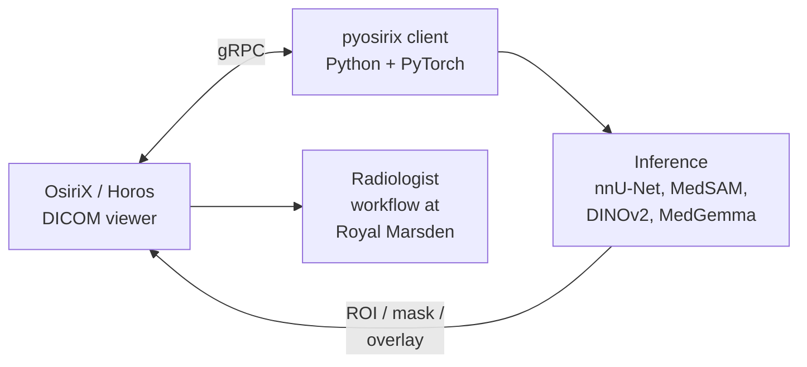

<!--
README v4: dialled back for deeptech/HF-audience credibility.
- Wave header swapped for a transparent (text-only) capsule, calmer.
- Typing SVG reduced to two substantive cycling lines, slate-grey, slower.
- Footer decorative wave replaced with snake-eats-contributions (real
  activity-driven SVG, generated by GitHub Action - signal not flourish).
- New "On Hugging Face" section surfacing the dinov2-small-mednist model.
- New "Currently / Recently / Reading" block - simonwillison-style updates.
- Mermaid architecture diagram for OsiriXgrpc - technical proof inline.
- Removed footer wave entirely.
-->

  

  

  
  
  
  
  

---

### About

I build production AI systems across healthcare, insurance, and applied research. PhD in medical imaging AI from the Institute of Cancer Research, where I shipped a clinical AI platform now used at The Royal Marsden Hospital. Before research, I led ML-driven pricing at Ageas Insurance.

Now running **MIRAI Analytics** - an AI and data analytics consultancy taking projects from scoping through to production deployment.

---

### Currently

- 🛠️ **Building:** End-to-end pricing engine for an insurance client, unifying technical (burn cost) and commercial (market price) models into a single optimiser pipeline.
- 🔬 **Experimenting:** Foundation-model adaptation for medical imaging - see `dinov2-small-mednist` on Hugging Face.
- 📖 **Reading:** *The Foundation Models Initiative* by Stanford CRFM; *Interpretable Machine Learning* by Christoph Molnar; recent MICCAI proceedings.

---

### Selected track record

| Domain | Result |
|---|---|
| Healthcare AI | Co-created **[OsiriXgrpc](https://github.com/osirixgrpc/osirixgrpc)** - a gRPC plugin for OsiriX that brings real-time AI inference into radiologists' DICOM workflows. Deployed at **The Royal Marsden Hospital**, supporting care pathways for **65,000+ patients/year**. Funded by the MedTech SuperConnector and the Sarcoma Accelerator Consortium. |
| Commercial ML | Led ML pricing at Ageas - delivered a **30% volume uplift** on motor new business |
| Research | **11 peer-reviewed publications** (MICCAI, AAAI, ISMRM, MIDL). Cancer Research UK 4-Year PhD Studentship |
| Open source | Contributor to [The Turing Way](https://github.com/the-turing-way/the-turing-way) (2.1k★) and [NL-Augmenter](https://github.com/GEM-benchmark/NL-Augmenter) (788★) |

---

### How OsiriXgrpc works

Removes the historical bottleneck for clinical AI translation: state-of-the-art models live in Python, but radiologists work in OsiriX. The plugin lets the two talk in real time, without forcing the clinical team to leave their viewing environment.

---

### On Hugging Face

DINOv2-small fine-tuned on MedMNIST v2 for medical image classification. MONAI-compatible, SafeTensors, Apache-2.0. Companion artefact to PhD research on foundation-model adaptation for clinical imaging.

More models in development. Follow [@t22000t](https://huggingface.co/t22000t) for updates.

---

### Tech I use most

**ML & Deep Learning**

**Medical Imaging & CV**

**Languages**

**Infra & Data**

---

### GitHub activity

  

  
  

  
  

---

### Selected publications

1. **OsiriXgrpc: Rapid Development and Deployment of State-of-the-Art AI for Clinical Practice** - AAAI 2022 (AI2SE Workshop)
2. **Radiomics Using Disentangled Latent Features from Deep Representation Learning in Soft-Tissue Sarcoma** - MIDL 2023
3. **Multimodal Fusion for Radiogenomics Classification of Brain Tumor** - MICCAI 2021 (BraTS Workshop)
4. **Uncertainty Quantification using U-Net with Monte Carlo Dropout** - MICCAI 2021 (QUBIQ Workshop)
5. **Test-Retest Repeatability of Data-Driven Radiomic Features from Deep Learning** - ISMRM 2022

Full list (11 papers): see [LinkedIn Publications](https://www.linkedin.com/in/timothysumhonmun/details/publications/).

---

### Recent activity

<picture>
  <source media="(prefers-color-scheme: dark)" srcset="https://raw.githubusercontent.com/timothy22000/timothy22000/output/github-snake-dark.svg" />
  <source media="(prefers-color-scheme: light)" srcset="https://raw.githubusercontent.com/timothy22000/timothy22000/output/github-snake.svg" />
  
</picture>

---

  <em>Open to conversations about applied AI roles, consulting engagements, and research collaborations where data and experimentation drive real commercial outcomes at speed.</em>

